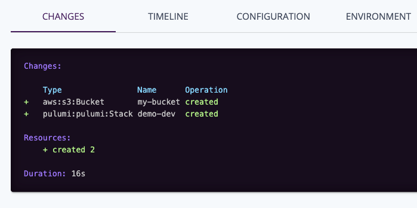
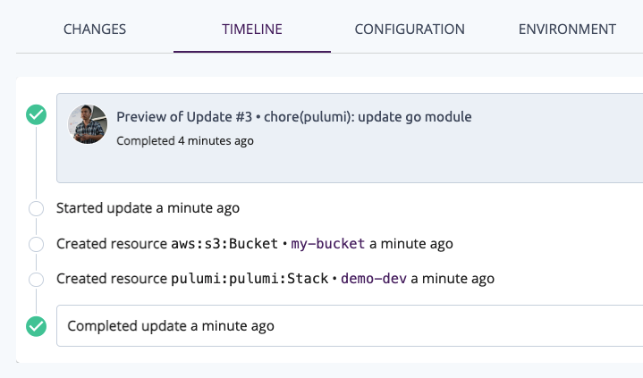

# 初始化 Pulumi 架構

## 步驟一: 建立新的 S3 Bucket

```go
		bucket, err := s3.NewBucket(ctx, "my-bucket", nil)
		if err != nil {
			return err
		}
```

## 步驟二: 執行 Pulumi CLI 預覽

透過底下指令可以直接預覽每個操作步驟所做的改變:

```sh
pulumi up
```

可以看到底下預覽:

```sh
Previewing update (dev)

View Live: https://app.pulumi.com/appleboy/demo/dev/previews/db6a9e4e-f391-4cc4-b50c-408319b3d8e2

     Type                 Name       Plan
 +   pulumi:pulumi:Stack  demo-dev   create
 +   └─ aws:s3:Bucket     my-bucket  create

Resources:
    + 2 to create

Do you want to perform this update?  [Use arrows to move, enter to select, type to filter]
  yes
> no
  details
```

選擇最後的 details:

```sh
Do you want to perform this update? details
+ pulumi:pulumi:Stack: (create)
    [urn=urn:pulumi:dev::demo::pulumi:pulumi:Stack::demo-dev]
    + aws:s3/bucket:Bucket: (create)
        [urn=urn:pulumi:dev::demo::aws:s3/bucket:Bucket::my-bucket]
        acl         : "private"
        bucket      : "my-bucket-e3d8115"
        forceDestroy: false
```

可以看到更詳細的建立步驟及權限，在此步驟可以詳細知道 Pulumi 會怎麼設定 AWS 架構，透過此預覽方式避免人為操作失誤。

## 步驟三: 執行操作

看完上面的預覽，我們最後就直接執行:

```sh
Do you want to perform this update? yes
Updating (dev)

View Live: https://app.pulumi.com/appleboy/demo/dev/updates/3

     Type                 Name       Status
 +   pulumi:pulumi:Stack  demo-dev   created
 +   └─ aws:s3:Bucket     my-bucket  created

Outputs:
    bucketName: "my-bucket-9dd3052"

Resources:
    + 2 created

Duration: 17s
```

透過上述 UI 也可以看到蠻多詳細的資訊




## 步驟三: 顯示更多 Bucket 詳細資訊

```go
		// Export the name of the bucket
		ctx.Export("bucketID", bucket.ID())
		ctx.Export("bucketName", bucket.Bucket)
```

執行 `pulumi up`

```go
Updating (dev)

View Live: https://app.pulumi.com/appleboy/demo/dev/updates/4

     Type                 Name      Status
     pulumi:pulumi:Stack  demo-dev

Outputs:
  + bucketID  : "my-bucket-9dd3052"
    bucketName: "my-bucket-9dd3052"

Resources:
    2 unchanged

Duration: 7s
```

## 步驟四: 更新 Bucket 名稱

```go
func main() {
	pulumi.Run(func(ctx *pulumi.Context) error {
		// Create an AWS resource (S3 Bucket)
		bucket, err := s3.NewBucket(ctx, "my-bucket", &s3.BucketArgs{
			Bucket: pulumi.String("foobar-1234"),
		})
		if err != nil {
			return err
		}

		// Export the name of the bucket
		ctx.Export("bucketID", bucket.ID())
		ctx.Export("bucketName", bucket.Bucket)
		return nil
	})
}
```

透過 `pulumi up`

```sh
Previewing update (dev)

View Live: https://app.pulumi.com/appleboy/demo/dev/previews/7180c121-235c-40cc-9ae2-d0f68455296f

     Type                 Name       Plan        Info
     pulumi:pulumi:Stack  demo-dev
 +-  └─ aws:s3:Bucket     my-bucket  replace     [diff: ~bucket]

Outputs:
  ~ bucketID  : "my-bucket-9dd3052" => output<string>
  ~ bucketName: "my-bucket-9dd3052" => "foobar-1234"

Resources:
    +-1 to replace
    1 unchanged

Do you want to perform this update? details
  pulumi:pulumi:Stack: (same)
    [urn=urn:pulumi:dev::demo::pulumi:pulumi:Stack::demo-dev]
    --aws:s3/bucket:Bucket: (delete-replaced)
        [id=my-bucket-9dd3052]
        [urn=urn:pulumi:dev::demo::aws:s3/bucket:Bucket::my-bucket]
    +-aws:s3/bucket:Bucket: (replace)
        [id=my-bucket-9dd3052]
        [urn=urn:pulumi:dev::demo::aws:s3/bucket:Bucket::my-bucket]
      ~ bucket: "my-bucket-9dd3052" => "foobar-1234"
    ++aws:s3/bucket:Bucket: (create-replacement)
        [id=my-bucket-9dd3052]
        [urn=urn:pulumi:dev::demo::aws:s3/bucket:Bucket::my-bucket]
      ~ bucket: "my-bucket-9dd3052" => "foobar-1234"
    --outputs:--
  ~ bucketID  : "my-bucket-9dd3052" => output<string>
  ~ bucketName: "my-bucket-9dd3052" => "foobar-1234"
```

可以看到系統會砍掉舊的，在建立一個新的 bucket

## 下一個章節

=> [更新 AWS 架構 (S3 Hosting)](./04-updating-your-infrastructure.md)
